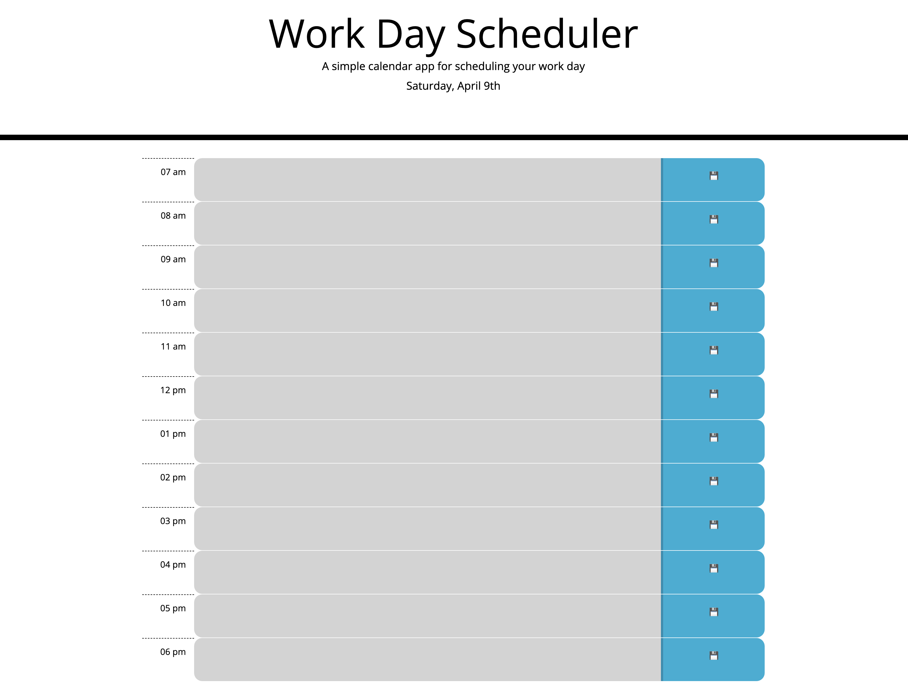

# Code Quiz

## Description

This project uses HTML, CSS and JavaScript to create workday scheduler app that has retention of events entered

## Installation

There is no installation needed, I have the page hosted here at Github.

Link: [https://cliff-rosenberg.github.io/05-Work_Day_Scheduler/](https://cliff-rosenberg.github.io/05-Work_Day_Scheduler/)

## Usage

Opening 'index.html' in a web browser will bring up the main screen. The day is divided into hours, each is an editable field for text entry. Clicking the disk icon on the right side of the text bar will save the text you have entered there.

<h2><u>Screenshots:</u></h2>

## License

MIT License

Copyright (c) 2022 Cliff Rosenberg

Permission is hereby granted, free of charge, to any person obtaining a copy
of this software and associated documentation files (the "Software"), to deal
in the Software without restriction, including without limitation the rights
to use, copy, modify, merge, publish, distribute, sublicense, and/or sell
copies of the Software, and to permit persons to whom the Software is
furnished to do so, subject to the following conditions:

The above copyright notice and this permission notice shall be included in all
copies or substantial portions of the Software.

THE SOFTWARE IS PROVIDED "AS IS", WITHOUT WARRANTY OF ANY KIND, EXPRESS OR
IMPLIED, INCLUDING BUT NOT LIMITED TO THE WARRANTIES OF MERCHANTABILITY,
FITNESS FOR A PARTICULAR PURPOSE AND NONINFRINGEMENT. IN NO EVENT SHALL THE
AUTHORS OR COPYRIGHT HOLDERS BE LIABLE FOR ANY CLAIM, DAMAGES OR OTHER
LIABILITY, WHETHER IN AN ACTION OF CONTRACT, TORT OR OTHERWISE, ARISING FROM,
OUT OF OR IN CONNECTION WITH THE SOFTWARE OR THE USE OR OTHER DEALINGS IN THE
SOFTWARE.
